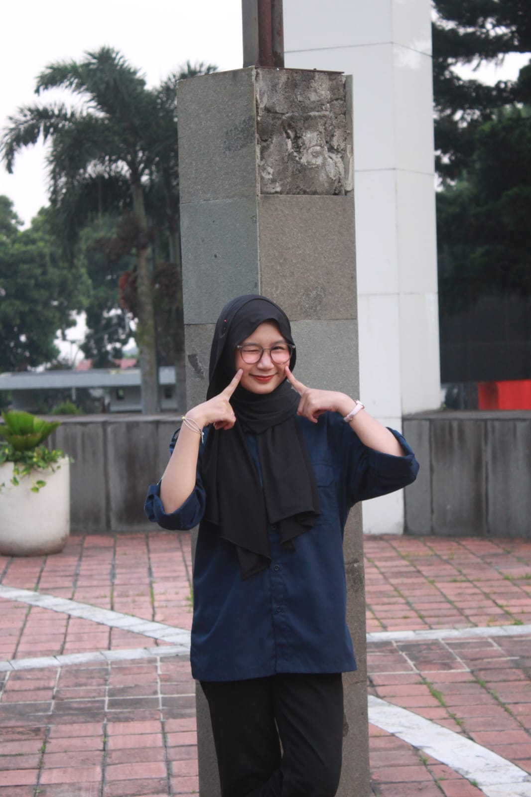

# ✨ Nazhwa Sava Azahra - Modern Biodata & Portfolio

> Redesign modern, profesional, dan interaktif untuk website biodata & portofolio **Nazhwa Sava Azahra** — Mahasiswa Pendidikan Ilmu Komputer di Universitas Pendidikan Indonesia (UPI).



---

## 🌟 Fitur Utama

- **Aesthetic Deep Space Glassmorphism**: Desain modern bertema dark mode dengan efek translusen, ambient gradient glow, dan animasi partikel canvas.
- **Bento Grid Layout**: Penataan informasi biodata rapi dan responsif, mencakup Identitas, Kampus UPI, Aspirasi & Cita-cita, Hobi, dan Skills.
- **Interaktivitas Modern**:
  - ✨ Animasi partikel mengambang dinamis
  - 🖱️ Efek cursor glow yang mengikuti pergerakan kursor
  - 🎴 Efek 3D card tilt interaktif pada kartu bento
  - 📋 Tombol 1-klik salin NIM ke clipboard dengan notifikasi toast
  - 📸 Galeri *Little Moments ♡* dengan modal Lightbox interaktif
  - 📱 Tampilan 100% responsif untuk Mobile, Tablet, dan Desktop

---

## 🎓 Biodata Singkat

- **Nama Lengkap**: Nazhwa Sava Azahra
- **NIM**: 2505016
- **Program Studi**: Pendidikan Ilmu Komputer
- **Fakultas / Universitas**: FPMIPA — Universitas Pendidikan Indonesia (UPI)
- **Hobi**: Mendengarkan musik & bermain game
- **Cita-cita**: Menjadi kaya raya & sukses di dunia teknologi

---

## 🛠️ Teknologi yang Digunakan

- **HTML5**: Struktur semantik, modern, dan aksesibel
- **Vanilla CSS3**: Custom design tokens, glassmorphism, flexbox, CSS grid, dan keyframe animations
- **JavaScript (ES6+)**: Canvas animation, dynamic DOM interaction, event listeners, dan clipboard API

---

## 🚀 Menjalankan Secara Lokal

1. Clone repositori ini:
   ```bash
   git clone https://github.com/hmmdz09/biodata-nazhwa.git
   ```
2. Buka folder proyek:
   ```bash
   cd biodata-nazhwa
   ```
3. Buka file `index.html` langsung di browser favorit Anda, atau jalankan menggunakan live server:
   ```bash
   npx serve .
   ```

---

## 📬 Kontak & Media Sosial

- **Instagram**: [@sunghoonparj](https://instagram.com/sunghoonparj)
- **GitHub**: [@Nazhwazahraa](https://github.com/Nazhwazahraa)
- **Email**: [nazhwaazahra@student.upi.edu](mailto:nazhwaazahra@student.upi.edu)

---

Dibuat dengan 💜 & semangat belajar tanpa henti.
